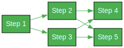
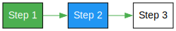

# WF (Workflow) Package




The wf package provides a flexible and extensible framework for defining
and executing automated tasks and processes in Go. It is designed for
computational workflows where steps are executed programmatically
without requiring manual intervention.

The Runnable interface is implemented by the Step, Pipeline, and Dag types,
providing a unified way to execute automated tasks.

The Step type is used for representing a single unit of automated work that
can be executed within a given context and specified data.

The Pipeline type is used for grouping related automated tasks and executing
them in sequence.

The Dag (Directed Acyclic Graph) type is used for advanced workflow management
with dependencies between automated tasks.

## Key Features

- **Flexible Initialization**: Initialize workflows with options like `WithName`, `WithID`, and `WithRunnables`
- **Automated Task Execution**: Define and execute tasks programmatically without manual intervention
- **Simple Step Definitions**: Easily define individual operations as reusable steps
- **Organized Pipelines**: Group related operations into logical pipelines for better maintainability
- **Flexible Dependencies**: Create complex workflows with step dependencies using DAG
- **Cycle Detection**: Automatically detects and prevents circular dependencies
- **Context Management**: Share data between steps using a context object
- **Error Handling**: Proper error propagation through the entire workflow
- **State Management**: Track and persist workflow execution state
- **Pause and Resume**: Ability to pause, save, and resume workflow execution
- **Testable**: Designed with testing in mind

## When to Use This Package

This package is ideal for:

- Data processing pipelines
- Automated build processes
- ETL workflows
- Batch processing jobs
- Service orchestration
- Automated testing pipelines
- Any process that can be executed programmatically

It is not suitable for:

- Human-driven approval workflows
- Manual review processes
- Step-by-step form completion
- Processes requiring manual intervention
- Business processes with human decision points

## Core Components

- [Step](https://github.com/dracory/base/blob/main/wf/step.go): Represents a single execution step with unique ID, name, and execution handler
- [Pipeline](https://github.com/dracory/base/blob/main/wf/pipeline.go): Groups related steps into a logical unit that can be treated as a single step
- [Dag](https://github.com/dracory/base/blob/main/wf/dag.go): Manages a collection of steps and their dependencies, executing them in the correct order
- [State](https://github.com/dracory/base/blob/main/wf/state.go): Manages workflow execution state, including status, completed steps, and workflow data

## Component Hierarchy

```
Runnable
├── Step (basic unit of work, single operation)
├── Pipeline (runs a set of runnables in the sequence they are added)
└── Dag (advanced workflow manager with dependencies between runnables)
```

## Usage Examples

### Creating Steps

```go
// Create a step with an execution function
step := NewStep()
step.SetName("My Step")
step.SetHandler(func(ctx context.Context, data map[string]any) (context.Context, map[string]any, error) {
    data["key"] = "value"
    return ctx, data, nil
})
```

### Creating a Pipeline

```go
// Create steps for a pipeline using options
step1 := NewStep(
    WithName("Process Data"),
    WithHandler(func(ctx context.Context, data map[string]any) (context.Context, map[string]any, error) {
        data["processed"] = true
        return ctx, data, nil
    }),
)

step2 := NewStep(
    WithName("Validate Data"),
    WithHandler(func(ctx context.Context, data map[string]any) (context.Context, map[string]any, error) {
    if !data["processed"].(bool) {
        return ctx, data, errors.New("data not processed")
    }
    return ctx, data, nil
})

// Create a pipeline
pipeline := NewPipeline(
    WithName("Data Processing Pipeline"),
    WithRunnables(step1, step2), // Add steps during creation
)

// Or add steps later
// pipeline.RunnableAdd(step1, step2)
```

### Creating a DAG

```go
// Create a DAG with options and dependencies
dag := NewDag(
    WithName("My DAG"),
    WithRunnables(step1, step2), // Add steps during creation
    WithDependency(step2, step1), // step2 depends on step1
)

// Alternative way to add steps and dependencies later
// dag.RunnableAdd(step1, step2)
// dag.DependencyAdd(step2, step1)
```

### Using a Pipeline in a DAG




```go
// Create a pipeline with steps using options
pipeline := NewPipeline(
    WithName("Data Processing Pipeline"),
    WithRunnables(step1, step2),
)

// Create a DAG with a pipeline and dependencies
dag := NewDag(
    WithName("My DAG"),
    WithRunnables(pipeline, step3), // Add all nodes during creation
    WithDependency(step3, pipeline), // step3 depends on pipeline
)

// Alternative way to add nodes and dependencies later
// dag.RunnableAdd(pipeline, step3)
// dag.DependencyAdd(step3, pipeline)
```

### Executing Steps

```go
// Create a context and data map
ctx := context.Background()
data := make(map[string]any)

// Execute all steps
_, data, err := dag.Run(ctx, data)
if err != nil {
    // Handle error
}
```

### State Management

The workflow package provides robust state management capabilities that allow
you to track, save, and restore the execution state of any workflow.

This is particularly useful for long-running workflows that may need to be
paused, saved, and resumed later.

```go
// Create a workflow
dag := NewDag()
dag.SetName("My Workflow")

// Add steps and dependencies...

// Start workflow
ctx := context.Background()
data := make(map[string]any)
ctx, data, err := dag.Run(ctx, data)

// Pause workflow
if err := dag.Pause(); err != nil {
    // Handle error
}

// Save state
state := dag.GetState()
stateJSON, err := state.ToJSON()
if err != nil {
    // Handle error
}

// Create new workflow instance
newDag := NewDag()

// Load saved state
newState := NewState()
if err := newState.FromJSON(stateJSON); err != nil {
    // Handle error
}
newDag.SetState(newState)

// Resume workflow
ctx, data, err = newDag.Resume(ctx, data)
```

#### How State Management Works

1. **State Tracking**: The workflow automatically tracks its execution state, including:

   - Current status (Running, Paused, Complete, Failed)
   - Completed steps
   - Current step being executed
   - Workflow data

2. **State Transitions**: The workflow enforces valid state transitions:

   - A workflow starts in the "Running" state
   - A running workflow can transition to "Paused", "Complete", or "Failed"
   - A paused workflow can only transition back to "Running"
   - Completed or failed workflows are terminal states with no valid transitions

3. **Pause and Resume**: You can pause a running workflow at any time:

   - The `Pause()` method sets the state to "Paused"
   - The `Resume()` method continues execution from where it was paused
   - The workflow remembers which steps were completed

4. **State Serialization**: The state can be serialized to JSON:

   - `ToJSON()` converts the state to a JSON byte array
   - `FromJSON()` loads a state from a JSON byte array
   - This allows saving the state to a file or database

5. **State Restoration**: You can restore a workflow to a previous state:

   - Create a new workflow instance
   - Load the saved state using `FromJSON()`
   - Set the state using `SetState()`
   - Resume execution using `Resume()`

6. **Helper Methods**: The workflow provides helper methods to check the current state:
   - `IsRunning()` - checks if the workflow is currently running
   - `IsPaused()` - checks if the workflow is paused
   - `IsCompleted()` - checks if the workflow has completed successfully
   - `IsFailed()` - checks if the workflow has failed
   - `IsWaiting()` - checks if the workflow is waiting to start

This state management system enables robust workflow execution that can survive interruptions, system restarts, or distributed execution across multiple machines.

## Testing

The package includes comprehensive tests that verify:

- Successful step execution
- Error propagation
- Dependency handling
- Context data sharing
- Cycle detection
- Parallel execution
- Serialization
- State management
- Pause and resume functionality

## Dependencies

- `github.com/gouniverse/uid`: For generating unique IDs

## Best Practices

1. Always use the provided interfaces for type safety
2. Handle errors appropriately in step implementations
3. Use the context for data sharing between steps
4. Define dependencies when steps must be executed in a specific order
5. Avoid creating circular dependencies between steps
6. Use pipelines to group related steps into logical units
7. Implement proper error handling in each step
8. Save workflow state at appropriate points for recovery
9. Use the state management features for long-running workflows

## Examples

The package includes several examples demonstrating different use cases:

### Basic Usage Example

- Shows how to create and execute simple steps
- Demonstrates basic step dependencies
- Location: [examples/dag_basic_usage](examples/dag_basic_usage)

### Conditional Logic Example

- Demonstrates how to implement conditional logic using DAGs and pipelines
- Shows different step chains for different scenarios
- Location: [examples/dag_conditional_logic](examples/dag_conditional_logic)

### Dependencies Example

- Shows how to create steps with complex dependencies
- Demonstrates proper execution order through dependencies
- Location: [examples/dag_dependencies](examples/dag_dependencies)

### Error Handling Example

- Demonstrates error handling in a DAG
- Shows how errors are propagated through the DAG
- Location: [examples/dag_error_handling](examples/dag_error_handling)

### State Management Example

- Demonstrates workflow state management
- Shows how to pause, save, and resume workflows
- Location: [examples/dag_state](examples/dag_state)

## Error Handling

The package will return errors in the following cases:

- If a cycle is detected in the dependency graph
- If any step execution fails
- If a step is added multiple times
- If dependencies are not properly defined
- If pipeline execution fails
- If conditional logic conditions are not met
- If state management operations fail
- If workflow cannot be paused or resumed
